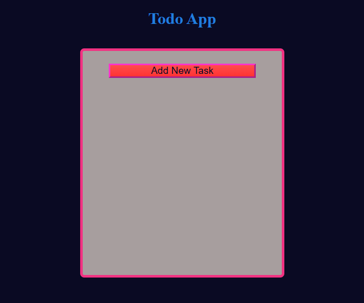
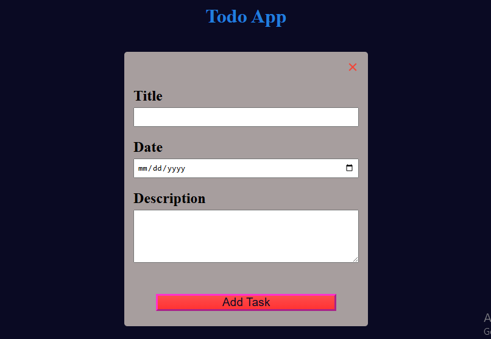

# 📝 To-Do App

## 📖 Project Overview

The **To-Do App** is a simple yet powerful task management web application that allows users to organize their daily tasks efficiently. Built using **HTML**, **CSS**, and **JavaScript**, this app leverages **Local Storage** to store data persistently in the browser, ensuring your tasks remain saved even after refreshing or closing the tab.

This project showcases how to perform **CRUD (Create, Read, Update, Delete)** operations, handle user input, manage state with Local Storage, and dynamically update the UI using DOM manipulation.

---

## ✨ Features

### 🧾 Dynamic Task Management

* Add, edit, delete, and mark tasks as completed.
* Each task updates dynamically in real-time without page reloads.
* Completed tasks visually differ for easy tracking.

### 💾 Local Storage Integration

* Tasks are stored in the browser’s **Local Storage**, ensuring persistence between sessions.
* Uses `localStorage.setItem()`, `localStorage.getItem()`, and `localStorage.removeItem()` for managing data.

### ⚙️ CRUD Operations

* **Create** – Add a new task through the form input.
* **Read** – Retrieve and display all tasks on page load.
* **Update** – Edit existing tasks or toggle completion status.
* **Delete** – Remove a task from both the UI and Local Storage.

### 💡 Event Handling

* Implements event listeners for form submissions, buttons, and toggles.
* Demonstrates how to handle multiple user interactions efficiently.

### 🎨 Responsive UI & Styling

* Clean and modern design for smooth user experience.
* Hover and focus effects for better interactivity.
* Fully responsive layout that adjusts seamlessly across desktop and mobile devices.

---

## 🛠️ Technical Details

### 🧩 HTML

* Structured with semantic elements for clarity and accessibility.
* Includes a form for adding tasks and a container for rendering task lists dynamically.

### 🎨 CSS

* Designed with a minimalist approach focusing on usability and clarity.
* Uses flexbox for layout organization and responsive alignment.
* Implements hover and transition effects for a polished feel.

### ⚙️ JavaScript

* Handles all core logic using modern JavaScript methods.
* Uses **DOM manipulation** to dynamically update the UI.
* Integrates **Local Storage API** to store and retrieve data persistently.
* Utilizes array methods like `map()`, `forEach()`, and `filter()` for managing tasks efficiently.

---

## 🖼️ Sneak Peek

Here’s a glimpse of the To-Do App interface:

---

## 💻 GitHub Repository

🔗 **[View Source Code on GitHub](https://github.com/kal1kidan/ToDoApp)**

---

## 🎯 Purpose

This project demonstrates how **JavaScript**, combined with **HTML** and **CSS**, can create a fully functional, data-driven web application without external frameworks. It’s an essential step in understanding Local Storage, dynamic DOM updates, and event handling — key foundations for advanced frontend development.

---
